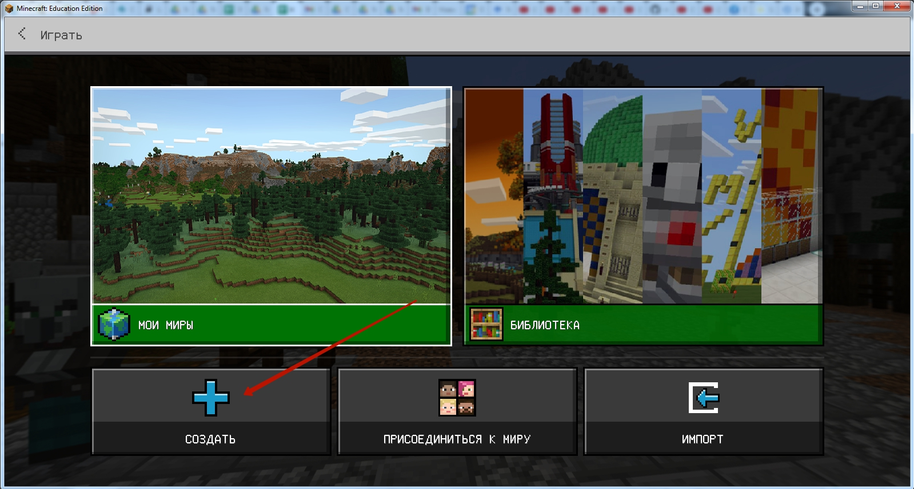
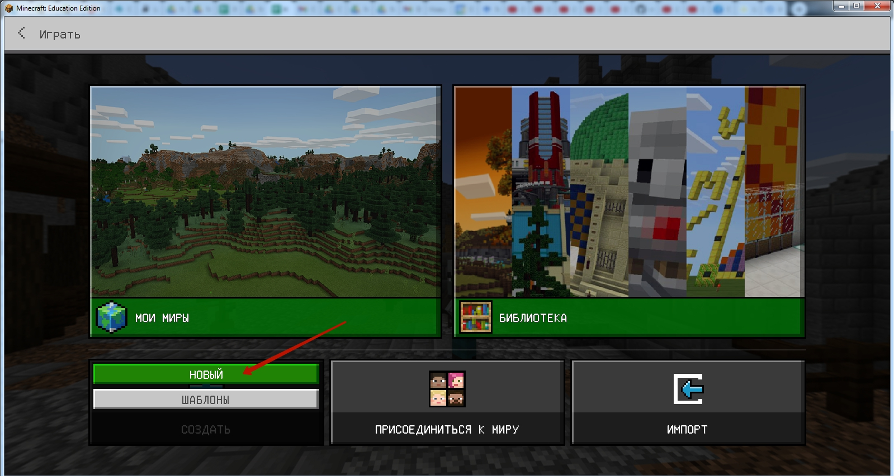
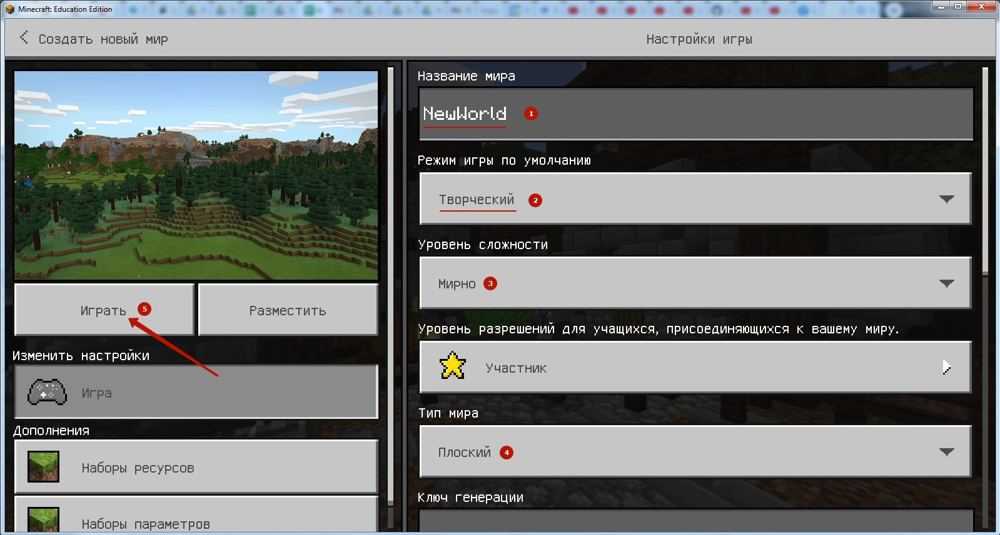
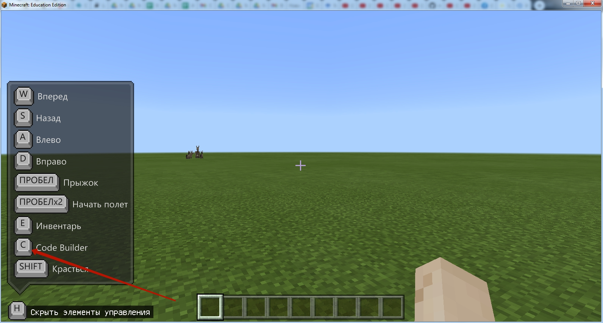
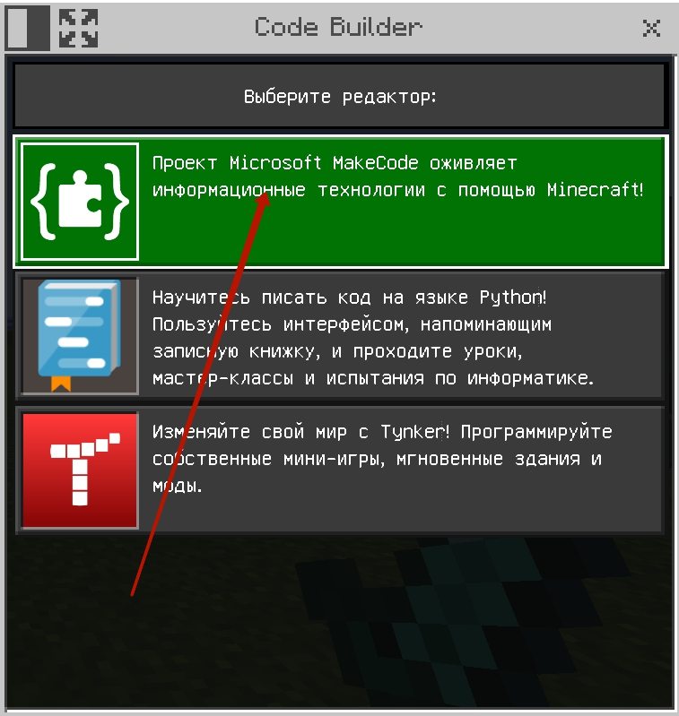
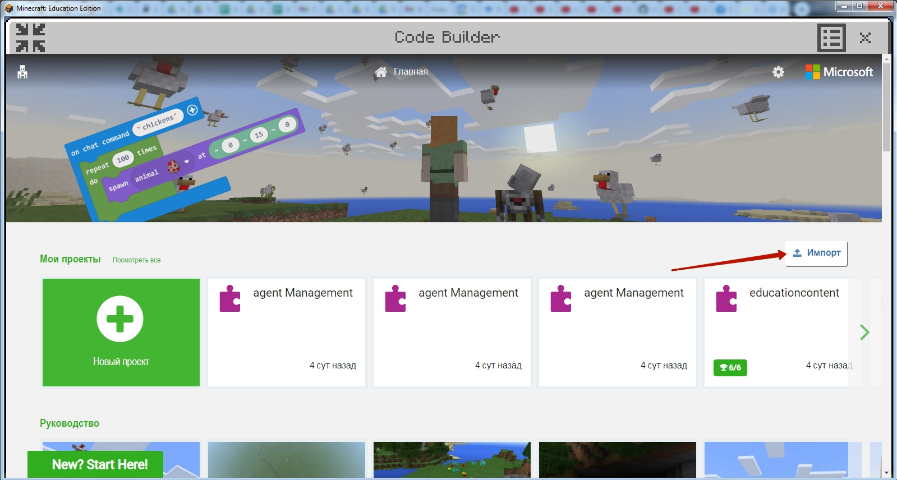
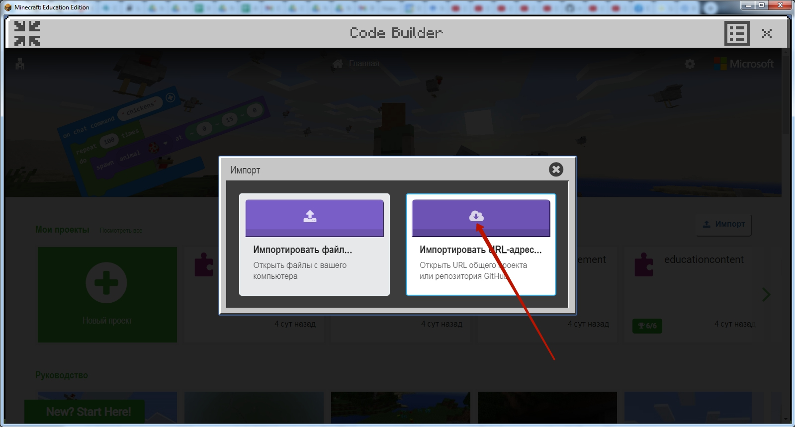
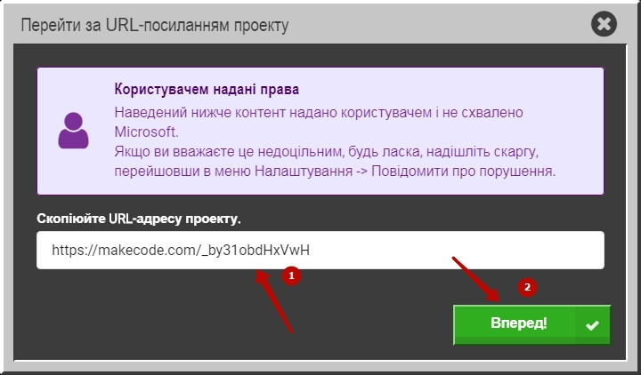
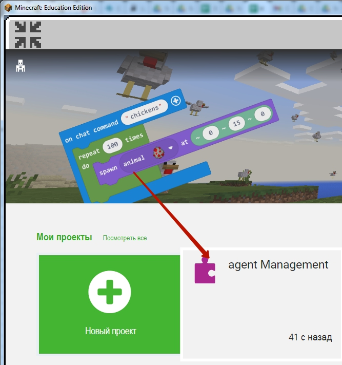
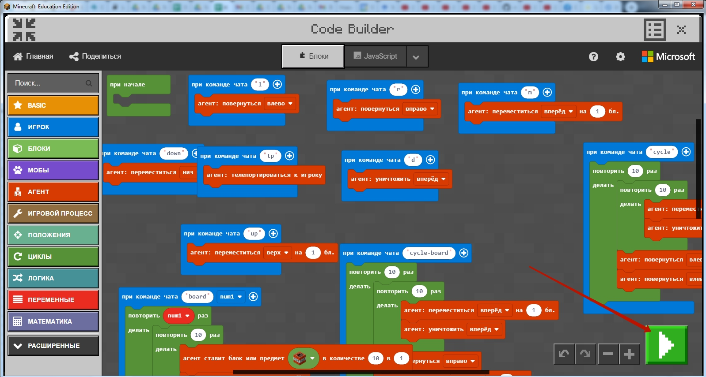

# Minecraft - вход
## Вводим логин и пароль, которые вы получили от менеджера при регистрации.

## Выбираем поле "Играть"

## Создаем новый мир

  

## Настраиваем новый мир

* Пишем название  
* Режим игры: **Творческий**
* Уровень сложности: **Мирно**
* Тип мира: **Плоский**
После настройки - нажимаем кнопку **"Играть"**

## Включаем редактор кода (Code Builder)  

  

Нажимаем кнопку **C**  
  
Выбираем режим **"Microsoft Make Code"** - верхний в списке.  

## Импортируем Код  
  
Нажимаем кнопку "Импорт"  

  

Выбираем блок "Импортировать URL-адрес"   

  

Вставляем ссылка на код:  
https://makecode.com/_3CEahD7e261A  

  
Выбираем блок agent Management

  
Запускаем полученный код

