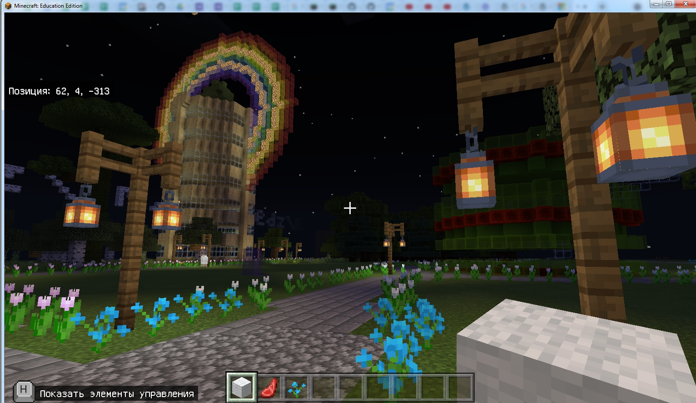
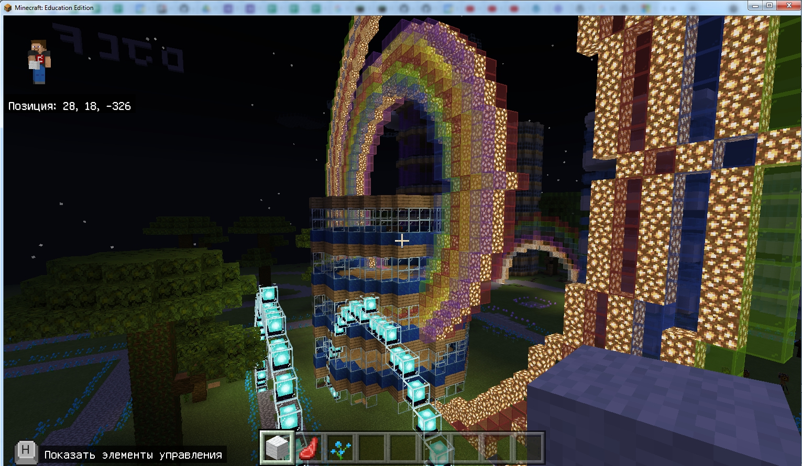
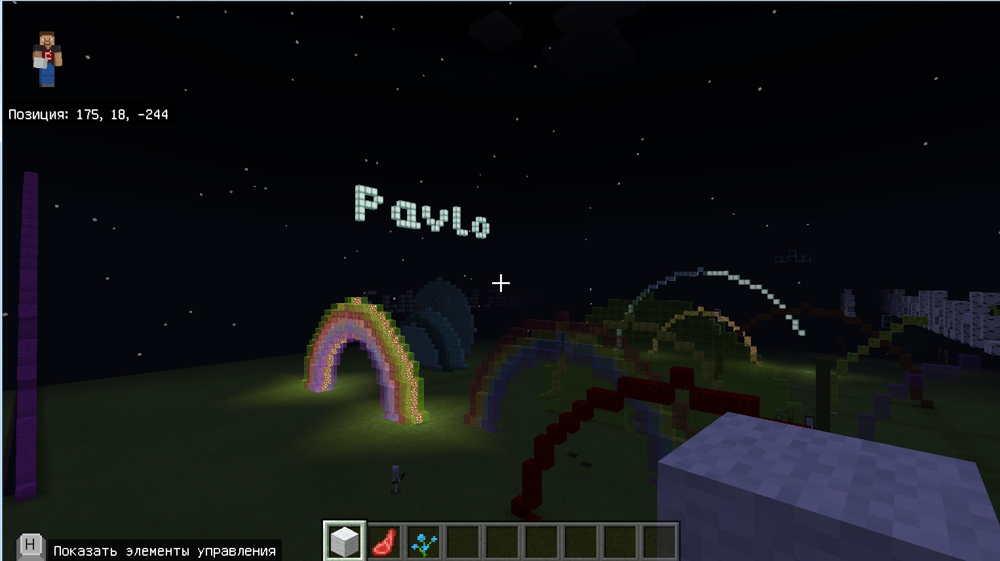
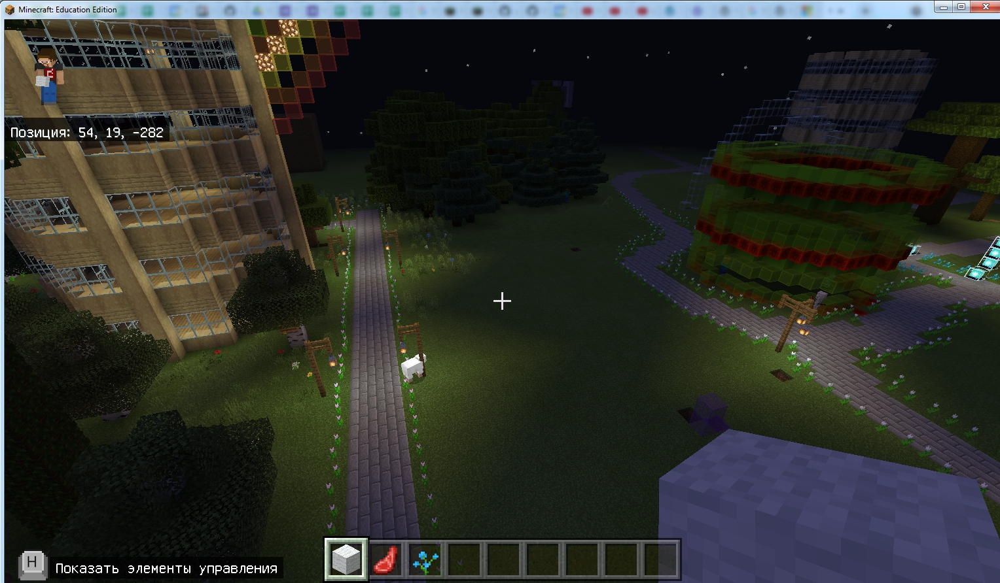

# Основная часть
## 1. Представление.
Легенда о преподавателе - кто он и почему ведет занятие (формирование доверия).

## 2. Знакомство с участниками.
Кто, из какого города, программировали ли ранее.

## 3. О занятии.
Мы сегодня с Вами познакомимся с Minecraft Education - это образовательный мод Minecraft. В нем вы сможете обучаться программированию, оставаясь в среде одной из самых популярных игр.
## 4. Основная часть занятия.
### 4.1. Корректируем уже написанный код.
В данном блоке мы используем код, который программирует агента на построения набора блоков с зубцами в 3 блока. В результате исправления кода - агент строит прямоугольник из динамита (без зубцов).  

4.1.1. Нажмите кнопку **t** на клавиатуре для открытия чата.  
  

4.1.2. В чате введите команду **tp**.  
  

4.1.3. К вам телепортируется агент.  
  

4.1.4. Нажмите кнопку **t** на клавиатуре для открытия чата.    
  

4.1.5. Введите команду **b**.  
  

4.1.6. Будет построен блок из динамита (с зубцами в 3 блока).  
  
  

4.1.7. Нажмите клавишу **c** на клавиатуре для открытия *редактора кода*. И пролистайте вниз.  
  

4.1.8. В меня **Агент** (1) возьмите блок "Агент: Переместиться вперед на 1 бл. (2).  
  
  

4.1.9. Замените количество блоков для перемещения вперед с 1 на 3.  
  

4.1.10. Повторите действие для другого блока.  
  
  
  

4.1.11. Проверьте все что изменено. И нажмите зеленую кнопку с треугольником.  
  

4.1.12. Перейти на свободное место. Нажать клавишу **t** на клавиатуре (откройте чат). Наберите команду  **tp** - телепортируйте к себе агента.  
  

4.1.13. Введите команду **b**.  
   

4.1.14. Агент построит блок из динамита, уже без зубцов.  
  
  

### 4.2. Пишем код функционала  
В этом блоке мы пишем код, который программирует агента перемещаться вперед на 7 шагов и атаковать после каждого шага (инструмент помощи игроку). Запускается данный код при использовании (нажатии правой клавиши мыши) *алмазного меча*.  
4.2.1. Нажимаем **e**, чтобы открыть инвентарь персонажа. Берем алмазный меч в первую ячейку.  
   1.Выбираем блок "Мечи и шлемы". 2.Выбираем мечи. 3-4. Выбираем алмазный меч в ячейку **1**. 5. Закройте блок инвентаря.  
  

4.2.2. В меню "Игрок" взять блок "При использовании железной лопаты" и перетащить на свободное место на рабочем поле.  
  

4.2.3. Нажимаем на треугольник возле изображении железной лопаты (1) и выбираем алмазный меч (2).  
  

4.2.4. В пункте меню "Агент". Возьмите блок "Телепортироваться к игроку" и поставьте блок внутрь синего "крокодильчика" при использовании предмета.  
  

4.2.5. В пункте меню "Циклы" берем блок "Повторить 4 раз" и вставляем под блок "Телепортироваться к игроку".  
  

4.2.6. Изменить число 4 на число 7.  
    

4.2.7. В меню "Агент" (1), прокрутить вниз (2), взять блок "Атаковать вперед" и поставить внутрь зеленого "крокодильчика" "Повторить 7 раз"   
  

4.2.8. В меню "Агент" (1), блок переместиться вперед на 1 блок. Под блоком "Агент: атаковать вперед"  
  

4.2.9. Взлетаем (дважды нажимаем пробел). Начинаем смотреть в ту сторону, куда смотрит агент. Летим вперед и ищем моба.  
  

4.2.10. Находим моба и спускаемся (один раз нажимаем пробел).  
  

4.2.11. Нажимаем правой клавишей (агент выбегает из-за спины и атакует моба).  
  

## 5. Презентация курса.
<a href = "https://github.com/mikh-maksi/goiteens-courses/raw/main/02minecraft/00probe/ru/main/files/go-iteens-minecraft.pdf">Презентация курса в формате PDF</a>  
<a href = "
https://github.com/mikh-maksi/goiteens-courses/raw/main/02minecraft/00probe/ru/main/files/go-iteens-minecraft.pptx
">Презентация курса в формате PPTX</a>

## 6. Презентация проектов курса.
В процессе обучения на курсе вы научитесь строить города. Это работа группы, которая проучилась 2 месяца.  
  
  
  
  
<a href = "https://github.com/mikh-maksi/goiteens-courses/raw/main/02minecraft/00probe/ru/main/files/demo_world.mcworld">Архив мира для скачивания.</a>

## 7. Завершение.
Буду рад (рада) видеть вас на курсе.
## 8. Видео.
<a href = "https://drive.google.com/file/d/1rhhOXyx4UbBJU7e9-i4u_H6R3gYvn_3d/view?usp=sharing">Видео пробного с конверсией 42%.</a>
